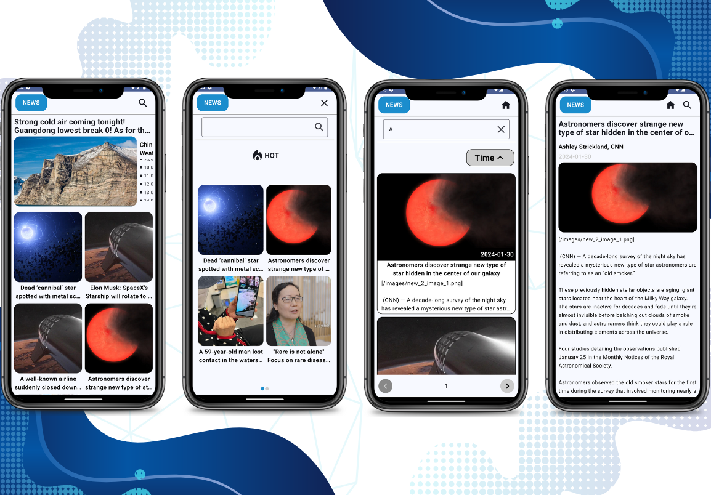
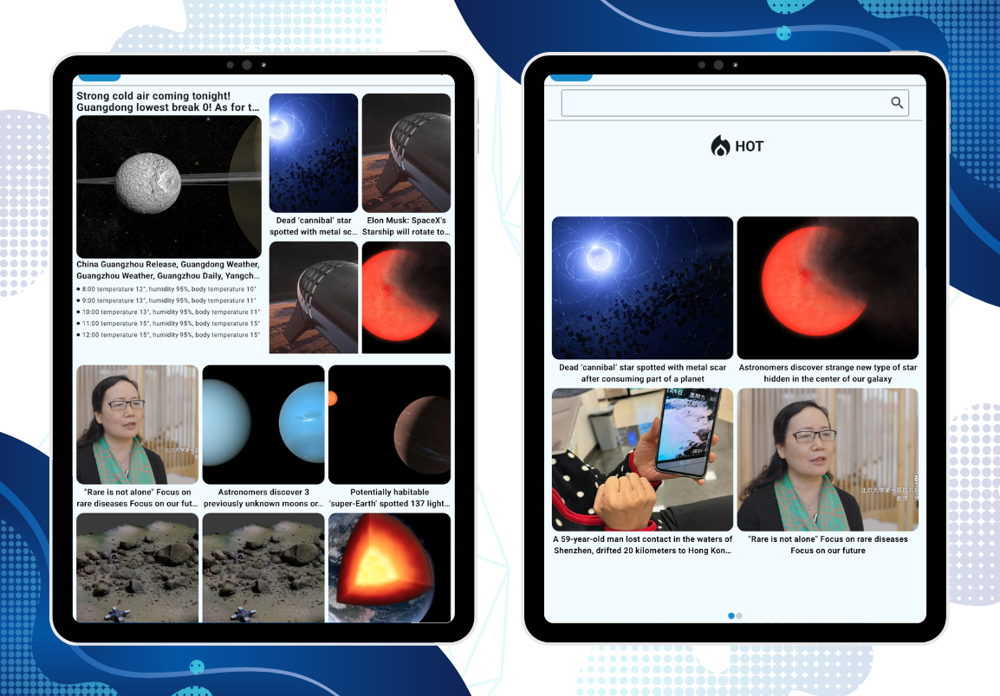

<h1 align="center">ChinApp</h1>

  
             

  
📰 Aplicacion android con enfoque practico, demuestra desarrollo android moderno con Jetpack Compose basado en consumo de JSON local y responsive entre diferentes dispositivos 📱

  
  
  

